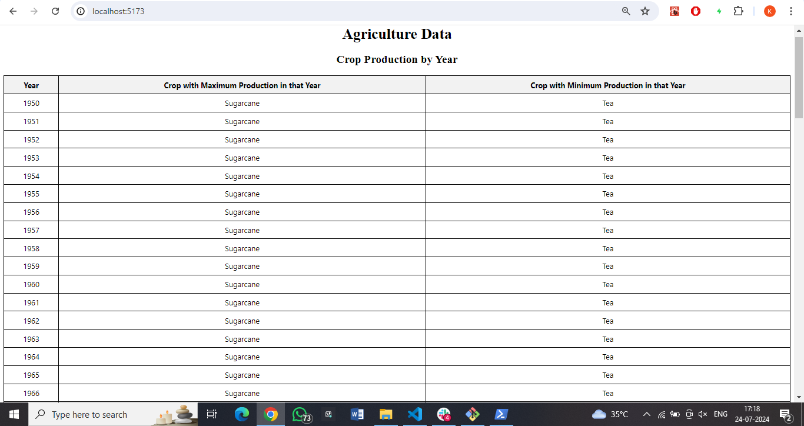
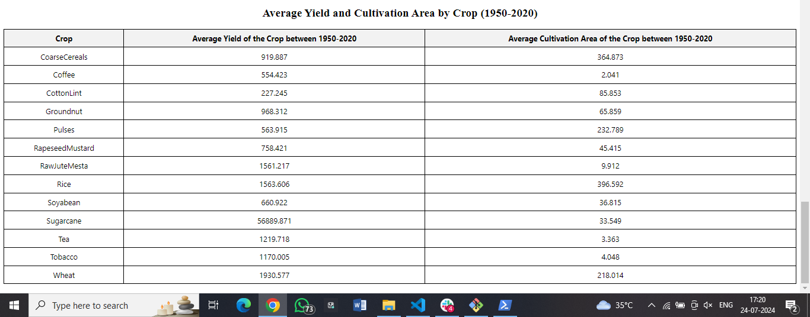

# Advanced Agriculture Data Table Web App

This project is an advanced data table web app built using Vite+React+Typescript. The application processes and visualizes Indian agriculture data from a JSON file, providing users with two tables: one aggregating crop data by year with maximum and minimum production, and the other aggregating average yield and cultivation area by crop between 1950-2020.

## Table of Contents
- [Introduction](#introduction)
- [Features](#features)
- [Technologies Used](#technologies-used)
- [Installation](#installation)
- [Usage](#usage)
- [Screenshots](#screenshots)
- [Contributing](#contributing)
- [Contact](#contact)

## Introduction
The goal of this project is to provide a comprehensive visualization of Indian agriculture data, enabling users to easily interpret and analyze crop production trends over the years. The app leverages modern web technologies to deliver a responsive and interactive user experience.

## Features
- **Data Visualization**: View crop production data by year and by crop.
- **Responsive Design**: Optimized for various screen sizes and devices.
- **Fast and Efficient**: Built with Vite, ensuring quick load times and smooth performance.

## Technologies Used
- **Frontend**: React 
- **Styling**: CSS, Mantine 
- **Data Processing**: TypeScript
- **Build Tool**: Vite

## Installation
To set up the project locally, follow these steps:

1. **Clone the repository**:
    git clone https://github.com/kunalg3/agricultural-data-app.git
    cd agricultural-data-app

2. **Install dependencies**:
    yarn install

3. **Run the development server**:
    yarn dev

4. **Open your browser and navigate to**:
    http://localhost:5173
    As the Vite generally open in this port , where as you can also navigate where the project is running.

## Usage
  **Viewing Data**:
    - Navigate to the main page to view aggregated crop data by year and aggregating average yield and cultivation area by crop between 1950-2020.

## Screenshots
### Crop Production by Year

### Average Yield and Cultivation Area by Crop

## Contributing
Contributions are welcome! Please follow these steps to contribute:

1. Fork the repository.
2. Create a new branch (`git checkout -b feature-branch`).
3. Make your changes.
4. Commit your changes (`git commit -m 'Add new feature'`).
5. Push to the branch (`git push origin feature-branch`).
6. Create a Pull Request.

## Contact
For any questions or inquiries, please contact:
- **Name**: Kunal Goyal
- **Email**: kunalgoyal446@gmail.com
- **GitHub**: [kunalg3](https://github.com/kunalg3)
- **Phone**: +91 8266830511

Thank you for reviewing my project. Please let me know if you have any questions or require further information.